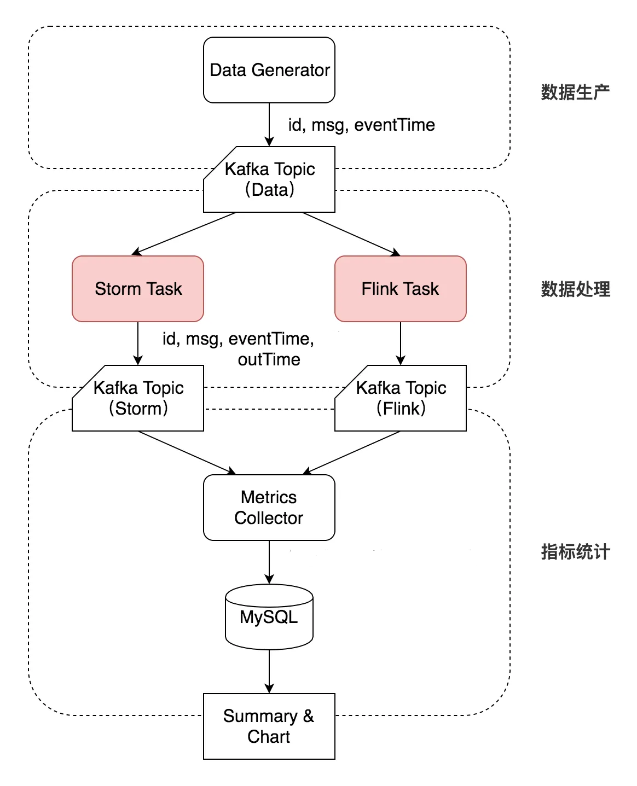

# Flink vs Storm At-Least-Once 对比实验

完整的流处理系统对比实验项目，用于评估 **Flink** 和 **Storm** 在 **At-Least-Once** 语义下的性能表现（延迟、重复率、容错能力）。

## 🎯 项目特点

- ✅ **完整的实验框架**: 数据生成、流处理、指标收集全自动化
- ✅ **严谨的对比实验**: 内部故障（泊松分布）+ 外部故障（进程 Kill）
- ✅ **丰富的监控指标**: 延迟分布、重复率、吞吐量、故障恢复时间
- ✅ **一键式操作**: 自动化部署和实验脚本，开箱即用

---

## 📁 项目结构

```
DaseBigData-2025-E/
├── pom.xml                          # Maven 父工程
├── README.md                        # 项目说明（本文件）
│
├── data-generator/                  # 数据生成器模块
│   ├── pom.xml
│   └── src/main/java/...
│       └── DataGenerator.java      # 可配置 QPS 与总量
│
├── experiment-job/                  # 计算任务模块
│   ├── pom.xml
│   └── src/main/java/...
│       ├── FlinkAtLeastOnceJob.java                     # 正常版本
│       ├── FlinkAtLeastOnceJobWithFaultInjection.java   # 故障注入版本
│       ├── StormAtLeastOnceTopology.java                # 正常版本
│       └── StormAtLeastOnceTopologyWithFaultInjection.java  # 故障注入版本
│
├── metrics-collector/               # 指标收集器模块
│   ├── pom.xml
│   └── src/main/java/...
│       └── MetricsCollector.java
│
├── database/                        # 数据库脚本
│   ├── init.sql                    # MySQL 初始化（含快照机制）
│   └── init.sh                     # 自动化初始化
│
└── scripts/                         # 实验脚本
    ├── cluster-flink-start.sh      # 启动 Flink 集群
    ├── cluster-flink-stop.sh       # 停止 Flink 集群
    ├── cluster-storm-start.sh      # 启动 Storm 集群
    ├── cluster-storm-stop.sh       # 停止 Storm 集群
    ├── start-flink.sh              # Flink 正常实验
    ├── start-storm.sh              # Storm 正常实验
    ├── start-flink-fault-test.sh   # Flink 内部故障实验
    ├── start-storm-fault-test.sh   # Storm 内部故障实验
    ├── start-flink-external-fault-test.sh   # Flink 外部故障实验
    ├── start-storm-external-fault-test.sh   # Storm 外部故障实验
    ├── stop-all.sh                 # 停止所有实验
    ├── view-status.sh              # 查看实验状态
    └── monitor-experiment.sh       # 持续监控
```

---

## 🛠️ 技术栈

| 组件 | 版本 | 用途 |
|------|------|------|
| Java | 1.8 | 编程语言 |
| Maven | 3.6+ | 构建工具 |
| Flink | 1.14.6 | 流处理引擎（KafkaSource/KafkaSink） |
| Storm | 2.4.0 | 流处理引擎 |
| Kafka | 2.8.0 | 消息队列 |
| MySQL | 8.0 | 数据存储 |
| FastJSON | 1.2.83 | JSON 处理 |

---

## 🚀 快速开始

### 1. 编译项目

```bash
cd DaseBigData-2025-E
mvn clean package
```

### 2. 初始化数据库

```bash
# 在 Node 1 执行
mysql -u root -p < database/init.sql

# 验证
mysql -h node1 -u exp_user -ppassword stream_experiment -e "SHOW TABLES;"
```

### 3. 部署 JAR 包

将编译产物部署到对应节点：

- **Node 1**: `/opt/experiment/` → `experiment-job.jar` + 所有脚本
- **Node 2**: `/opt/experiment/` → `data-generator.jar`
- **Node 3**: `/opt/experiment/` → `metrics-collector.jar`

```bash
# 赋予脚本执行权限
cd /opt/experiment
chmod +x *.sh
```

---

## 🔬 实验环境

为 Storm 和 Flink 分别搭建由 1 台主节点和 2 台从节点（三个节点参数相同）构成的 Standalone 集群进行本次测试。

### 单节点参数

| 参数项 | 参数值 |
|--------|--------|
| CPU | AMD EPYC™ 处理器，睿频最高 3.7 GHz |
| Core | 4 |
| Memory | 8GB |
| Disk | 40G |
| OS | Ubuntu 20.04 64位 |

### 框架参数

| 参数项 | Storm 配置 | Flink 配置 |
|--------|-----------|------------|
| Version | Storm 2.4.0 | Flink 1.14.6 |
| Master Memory | 1024m | 1024M |
| Slave Memory | 1.6G × 2 × 2 | 3.2G × 2 |
| Parallelism | 1 supervisor<br>4 worker<br>Spout=4, Bolt=4 | 1 Task Manager<br>4 Task slots<br>全局并发=4 |

---

## 🏗️ 测试架构



### 节点部署

| 节点角色 | 组件部署 (Services) | 职责说明 |
|---------|---------------------|----------|
| **Node 1**<br>(Master/Infra) | • Zookeeper<br>• Kafka Broker<br>• MySQL<br>• Storm Nimbus<br>• Flink JobManager | 负责集群协调、消息存储和结果存储。<br>作为主节点，负责任务调度。 |
| **Node 2**<br>(Worker A) | • Kafka Broker<br>• Storm Supervisor<br>• Flink TaskManager<br>• Data Generator | 承担实际计算任务。<br>同时运行数据生成器（模拟数据源头）。 |
| **Node 3**<br>(Worker B)|• Kafka Broker<br> • Storm Supervisor<br>• Flink TaskManager<br>• Metrics Collector | 承担实际计算任务。<br>同时运行指标收集器（消费结果并写入数据库）。 |

### 资源配置对齐

| 配置项 | Storm (多进程模式) | Flink (多线程模式) | 原因分析 |
|--------|-------------------|-------------------|----------|
| 部署方式 | 每节点启动 2 个 Worker | 每节点启动 1 个 TaskManager | Storm 必须多进程；Flink 推荐单进程多槽位。 |
| 单进程内存 | 1.6 GB (`-Xmx`) | 3.2 GB (`-Xmx`) | Flink 的 1 个大进程等同于 Storm 的 2 个小进程。 |
| 单进程 CPU | 1 个 Slot (1 Core) | 2 个 Slot (2 Cores) | 保持 CPU 算力总量一致。 |
| 单节点总资源 | 3.2GB RAM / 2 Cores | 3.2GB RAM / 2 Cores | **总资源消耗相等** |

### 内部拓扑设计

内部拓扑保持一致（组件根据各自逻辑实现）：

#### Flink Job 内部拓扑（逻辑算子）

*[2节点 4 TaskManager，消耗 6.4G]*

- **Source**（并发=4）：从 `source_data` 读 Kafka 消息（4 分区）
- **Processing**（并发=4）：模拟 1ms 业务延迟，打上 `process_time` 等
- **Sink**（并发=4）：写入 `flink_sink` Kafka Topic

#### Storm Topology 内部拓扑（逻辑组件）

*[2节点 4 worker，消耗 6.4G]*

- **KafkaSpout**（并发=4）：从 `source_data` 读 Kafka 消息（4 分区）
- **ProcessBolt**（并发=4）：模拟 1ms 业务延迟，打上 `process_time` 等
- **KafkaSinkBolt**（并发=4）：写入 `storm_sink` Kafka Topic
- **Acker**（并发=1）：Storm 内部的可靠性组件

## 📊 实验类型

### 实验矩阵

| 实验类型 | Flink 脚本 | Storm 脚本 |
|---------|-----------|-----------|
| **正常实验** | `start-flink.sh` | `start-storm.sh` |
| **内部故障**<br>（业务逻辑异常，泊松分布） | `start-flink-fault-test.sh` | `start-storm-fault-test.sh` |
| **外部故障**<br>（进程 Kill，自动重启/重调度） | `start-flink-external-fault-test.sh` | `start-storm-external-fault-test.sh` |

---

## 🧪 实验示例

### 示例 1: 正常实验

```bash
# 1. 启动 Flink 集群
./cluster-flink-start.sh

# 2. 运行 Flink 实验（10万条消息，1500msg/s）
./start-flink.sh 100000 1500

# 3. 等待完成（约 80 秒）
sleep 120

# 4. 查看结果
mysql -h node1 -u exp_user -ppassword stream_experiment \
  -e "SELECT * FROM v_latency_stats WHERE 任务类型='flink';"

# 5. 停止实验
./stop-all.sh

# 6. 停止集群
./cluster-flink-stop.sh
```

### 示例 2: 内部故障实验（泊松分布）

```bash
# Flink: 10万条消息，2000msg/s，业务逻辑前故障，平均每5000条发生一次
./start-flink-fault-test.sh 100000 2000 before 5000

# Storm: 10万条消息，2000msg/s，1000 pending，Bolt执行前故障，平均每5000条一次
./start-storm-fault-test.sh 100000 2000 1000 bolt-before 5000
```

**参数说明（Data Generator）:**
- 参数1: Topic 名称
- 参数2: 发送速率 (msg/s)
- 参数3: 故障类型 (Flink: before/after; Storm: bolt-before/bolt-after)
- 参数4: Lambda（平均间隔消息数）

### 示例 3: 外部故障实验（进程 Kill）

```bash
# Flink: 10万条消息，2000msg/s，启动30秒后开始，每30秒Kill一次TM，共3次
./start-flink-external-fault-test.sh 100000 2000 30 3 30

# Storm: 10万条消息，2000msg/s，1000 pending，启动30秒后，每30秒Kill一次Worker，共3次
./start-storm-external-fault-test.sh 100000 2000 1000 30 3 30
```

**参数说明:**
- Data Generator: [Topic] [速率] [最大消息数] [运行时长(秒)]
- 故障注入: [故障延迟] [故障次数] [故障间隔]

---

## 📈 核心指标

### 1. 延迟统计

```sql
SELECT * FROM v_latency_stats;
```

输出：任务类型、总消息数、平均延迟、最小/最大延迟、P50/P95/P99 延迟

### 2. 重复率统计

```sql
SELECT * FROM v_duplicate_stats;
```

输出：任务类型、总消息数、唯一消息数、重复消息数、重复率、最大重复次数

### 3. 综合对比

```sql
SELECT * FROM v_comparison;
```

### 4. 快照机制

支持实验结果快照保存与对比：

```sql
-- 创建快照
CALL sp_create_snapshot('Flink-正常实验-20251217');

-- 查看快照历史
SELECT * FROM v_snapshot_history ORDER BY snapshot_time DESC;

-- 查看指定快照的数据
SELECT * FROM stats_snapshots WHERE snapshot_name = 'Flink-正常实验-20251217';
```

---

## 🔍 监控与调试

### Web UI
- **Flink**: http://node1:8081
- **Storm**: http://node1:8080

### 实时监控

```bash
# 查看实验状态
./view-status.sh

# 持续监控（每5秒刷新）
./monitor-experiment.sh
```

### 日志查看

```bash
# 数据生成器（Node 2）
ssh node2 "tail -f /opt/experiment/generator.log"

# 指标收集器（Node 3）
ssh node3 "tail -f /opt/experiment/collector-*.log"

# Flink JobManager（Node 1）
tail -f /opt/flink/log/flink-*-jobmanager-*.log
```

---

## 🎯 关键配置

### Flink At-Least-Once

```java
// Checkpoint 配置
env.enableCheckpointing(5000);  // 5秒间隔
env.getCheckpointConfig().setCheckpointingMode(CheckpointingMode.AT_LEAST_ONCE);
env.setParallelism(4);  // 并发度=4（对齐 4 个分区）

// 新版 Kafka Connector（推荐）
KafkaSource<String> source = KafkaSource.<String>builder()
    .setBootstrapServers("node1:9092,node2:9092,node3:9092")
    .setTopics("source_data")  // 4 分区自动创建
    .setStartingOffsets(OffsetsInitializer.earliest())
    .build();
```

### Storm At-Least-Once

```java
// Topology 配置
.setProcessingGuarantee(KafkaSpoutConfig.ProcessingGuarantee.AT_LEAST_ONCE);
conf.setNumAckers(1);  // 1个 Acker
conf.setNumWorkers(4);  // 4个 Worker

// 并发度配置（对齐 4 个分区）
builder.setSpout("kafka-spout", new KafkaSpout<>(spoutConfig), 4);  // Spout=4
builder.setBolt("process-bolt", new ProcessBolt(), 4);  // Bolt=4
builder.setBolt("sink-bolt", new KafkaSinkBolt(), 4);  // Sink=4

// 手动 ACK/FAIL
collector.ack(input);   // 成功处理
collector.fail(input);  // 处理失败，触发重试
```

### 故障注入机制

#### 内部故障（泊松分布）

```java
// 故障间隔服从指数分布
long interval = (long) (-lambda * Math.log(random.nextDouble()));

// 预先生成故障点
if (processedCount >= nextFaultAt) {
    throw new RuntimeException("Injected fault");
}
```

#### 外部故障（进程 Kill）

```bash
# Flink: Kill TaskManager → 脚本重启
kill -9 <TM_PID>
nohup /opt/flink/bin/taskmanager.sh start &

# Storm: Kill Worker → Nimbus 自动重调度
kill -9 <Worker_PID>
# Nimbus 会自动在其他节点重启 Worker
```

---

## 🗂️ 数据库设计

### 核心表结构

```sql
-- metrics 表（重复检测关键）
CREATE TABLE metrics (
    id BIGINT AUTO_INCREMENT PRIMARY KEY,
    job_type VARCHAR(50) NOT NULL,
    msg_id BIGINT NOT NULL,
    event_time BIGINT NOT NULL,
    in_time BIGINT DEFAULT 0,
    out_time BIGINT NOT NULL,
    latency INT NOT NULL,
    process_count INT DEFAULT 1,
    INDEX idx_job_type (job_type),
    UNIQUE KEY uk_job_msg (job_type, msg_id)  -- 重复检测
) ENGINE=InnoDB;
```

### 自动快照机制

```sql
-- stats_snapshots 表（保存实验快照）
CREATE TABLE stats_snapshots (
    id BIGINT AUTO_INCREMENT PRIMARY KEY,
    snapshot_name VARCHAR(200) NOT NULL,
    snapshot_time TIMESTAMP DEFAULT CURRENT_TIMESTAMP,
    task_type VARCHAR(50),
    metrics JSON,  -- 存储完整指标数据
    UNIQUE KEY uk_snapshot_name (snapshot_name)
);

-- 创建快照存储过程
CALL sp_create_snapshot('实验名称');
```

---

## 🔧 故障排查

### 问题 1: 数据生成器无法连接 Kafka

```bash
# 检查 Kafka 服务
jps | grep Kafka

# 检查 /etc/hosts
cat /etc/hosts | grep node

# 测试连接
telnet node1 9092
```

### 问题 2: Flink Job 提交失败

```bash
# 检查集群状态
./bin/flink list

# 查看 JobManager 日志
tail -f /opt/flink/log/flink-*-jobmanager-*.log
```

### 问题 3: 指标收集器无数据

```bash
# 检查 Kafka Topic 是否有数据
kafka-console-consumer.sh --bootstrap-server node1:9092 \
  --topic flink_sink --from-beginning --max-messages 10

# 检查数据库连接
mysql -h node1 -u exp_user -ppassword stream_experiment \
  -e "SELECT COUNT(*) FROM metrics;"
```

### 问题 4: Storm Topology 不能在 IDE 中运行

**原因**: `storm-core` 依赖在集群环境中提供，本地缺失。

**解决**: 将 JAR 包上传到集群，通过 `storm jar` 命令提交：

```bash
storm jar experiment-job.jar \
  com.dase.bigdata.job.StormAtLeastOnceTopology \
  Storm-Test
```


---

## 🔒 安全注意事项

1. **数据库密码**: 修改 `database/init.sql` 和代码中的默认密码
2. **网络隔离**: 建议在内网环境运行
3. **资源限制**: JVM 内存已限制为 512M，避免资源抢占
4. **端口开放**: 确保 Kafka 9092, MySQL 3306, Flink 8081, Storm 8080 可访问

---

## 📝 常用命令速查

```bash
# 编译项目
mvn clean package

# 启动 Flink 集群
./cluster-flink-start.sh

# 运行 Flink 正常实验
./start-flink.sh 100000 1500

# 运行 Flink 内部故障实验
./start-flink-fault-test.sh 100000 2000 before 5000

# 运行 Flink 外部故障实验
./start-flink-external-fault-test.sh 100000 2000 30 3 30

# 查看实验结果
mysql -h node1 -u exp_user -ppassword stream_experiment \
  -e "SELECT * FROM v_comparison;"

# 创建快照
mysql -h node1 -u exp_user -ppassword stream_experiment \
  -e "CALL sp_create_snapshot('实验名称');"

# 停止所有实验
./stop-all.sh

# 停止 Flink 集群
./cluster-flink-stop.sh

# 复位实验
mysql -h node1 -u exp_user -ppassword stream_experiment \
  -e "CALL sp_reset_experiment();"
```

---

## 📄 许可证

Apache License 2.0

---

## 👨‍💻 技术支持

如有问题，请检查：
1. 各节点的 `/etc/hosts` 配置
2. 所有服务的运行状态（Kafka, Flink, Storm, MySQL）
3. 防火墙和网络端口配置
4. 日志文件中的错误信息
