# Flink vs Storm At-Least-Once 语义对比实验报告

## 目录

- [研究目的](#研究目的)
- [研究内容](#研究内容)
- [实验](#实验)
  - [实验环境](#实验环境)
  - [单节点参数](#单节点参数)
  - [框架参数](#框架参数)
  - [技术栈](#技术栈)
  - [实验负载](#实验负载)
  - [实验步骤](#实验步骤)
    - [1. 基线实验（无故障场景）](#1-基线实验无故障场景)
    - [2. 内部故障实验（泊松分布异常注入）](#2-内部故障实验泊松分布异常注入)
    - [3. 外部故障实验（进程Kill与网络隔离）](#3-外部故障实验进程kill与网络隔离)
  - [实验结果与分析](#实验结果与分析)
  - [结论](#结论)
  - [分工](#分工)

---

## 研究目的

本实验旨在通过完整可复现的流处理系统，对比 **Apache Storm** 和 **Apache Flink** 在 **At-Least-Once** 语义下的实现机制与运行表现。重点考察在相同资源约束和相同业务负载条件下，两者在以下维度的差异：

- **消息可靠性**：消息丢失率与重复处理率
- **端到端延迟**：正常场景与故障场景下的延迟分布（平均延迟/P95/P99）
- **适用场景**：基于实验数据总结两种框架各自的优缺点

## 研究内容

### 1. At-Least-Once 语义实现机制对比

**Storm 的实现机制**：
- 基于 **Tuple Tree + Ack/Fail 重试机制**
- 每条消息在 Spout → Bolt 的处理链路中形成 Tuple Tree
- Acker 组件跟踪每个 Tuple 的处理状态
- 处理失败时仅重发失败的 Tuple，粒度为单条消息

**Flink 的实现机制**：
- 基于 **分布式一致性 Checkpoint + 状态回滚**
- 定期（如每 5 秒）对所有算子状态进行全局快照
- 故障时回滚到最近的 Checkpoint，重放该时间点之后的所有数据
- 粒度为 Checkpoint 间隔内的批量消息

### 2. 统一实验负载设计

为确保对比公平性，实验在以下方面保持一致：

- **输入数据一致**：使用统一的 Data Generator，固定 QPS（3000 msg/s）与总量（外部故障：1,800,000 条；内部故障：300,000）
- **处理逻辑一致**：Kafka 读取 → JSON 解析 → 1ms 模拟计算 → Kafka 写回
- **资源约束一致**：Node2/Node3 上 Storm 与 Flink 的 CPU/内存资源严格对齐：
  - Storm: 2 Worker × 1.6GB = 3.2GB / 2 Cores
  - Flink: 1 TaskManager × 3.2GB = 3.2GB / 2 Cores
- **并发度对齐**：Storm（Spout=4, Bolt=4）与 Flink（全局并发=4）均使用 4 并发

### 3. 故障场景设计

#### 3.1 内部故障（业务逻辑异常）

- **实现方式**：在算子/bolt 内部按 **泊松分布** 抛出异常
- **参数控制**：`FAULT_LAMBDA`（平均每处理 N 条消息触发一次故障）
- **故障位置**：
  - Flink: `before`（处理前）/ `after`（处理后）
  - Storm: `bolt-before` / `bolt-after`
- **观测目标**：框架自恢复行为、重复率变化、延迟抖动

#### 3.2 外部故障（集群级异常）

通过自动化脚本注入以下三类故障：

| 故障类型 | Flink 脚本 | Storm 脚本 | 模拟场景 |
|---------|-----------|-----------|----------|
| **Kill Master** | `./inject-fault-flink.sh  kill-jm 1 60 poisson` | `./inject-fault-storm.sh kill-nimbus 1 60 poisson` | 主节点意外宕机 |
| **Kill Worker** | `./inject-fault-flink.sh kill-tm 1 60 poisson` | `./inject-fault-storm.sh kill-worker 1 60 poisson` | 工作节点进程崩溃 |
| **网络隔离** | `./inject-fault-flink.sh  network-tm 1 60 poisson` | `./inject-fault-storm.sh network-worker 1 60 poisson` | 网络分区/闪断 |

- **注入方式**：支持固定间隔（`fixed`）或泊松分布（`poisson`）
- **自动恢复**：
  - Flink Standalone 模式下脚本模拟 YARN 的自动重启机制
  - Storm 依赖 Nimbus + Supervisor 的原生自动调度
- **观测目标**：恢复时间、吞吐量变化、恢复后重复率

### 4. 指标体系

所有实验数据写入 MySQL，通过预定义视图与存储过程进行分析：

- **消息丢失率**：`(1 - COUNT(DISTINCT msg_id) / 总发送数) × 100%`
- **重复处理率**：`(SUM(process_count - 1) / 总处理次数) × 100%`
- **端到端延迟**：`out_time - event_time`，统计 平均延迟/P95/P99
- **快照机制**：每组实验结束后调用 `sp_create_snapshot()` 保存结果，支持历史对比
## 实验

### 实验环境

为 Storm 和 Flink 分别搭建由 **1 台主节点 + 2 台工作节点** 构成的 Standalone 集群，三台机器硬件参数一致。采用 **主从混合部署** 模式，确保 Kafka 与 MySQL 等基础设施与计算任务资源隔离，保证对比公平性。

#### 节点部署架构

| 节点角色 | 组件部署 | 职责说明 |
|---------|---------|----------|
| **Node 1**<br>(Master/Infra) | • Zookeeper<br>• Kafka Broker<br>• MySQL<br>• Storm Nimbus<br>• Flink JobManager | 集群协调、消息存储、结果存储<br>作为主节点负责任务调度 |
| **Node 2**<br>(Worker A) | • Storm Supervisor<br>• Flink TaskManager<br>• Kafka Broker<br>• **Data Generator** | 承担计算任务<br>运行数据生成器（模拟数据源） |
| **Node 3**<br>(Worker B) | • Storm Supervisor<br>• Flink TaskManager<br>• Kafka Broker<br>• **Metrics Collector** | 承担计算任务<br>运行指标收集器（消费结果并写入MySQL） |

#### 资源配置对齐

为保证对比公平性，严格控制每个 Worker 节点上 Storm 与 Flink 的资源消耗：

| 配置项 | Storm (多进程模式) | Flink (多线程模式) | 说明 |
|--------|-------------------|-------------------|------|
| **部署方式** | 每节点 2 个 Worker | 每节点 1 个 TaskManager | Storm 必须多进程；Flink 单进程多槽位 |
| **单进程内存** | 1.6 GB (`-Xmx`) | 3.2 GB (`-Xmx`) | Flink 的 1 个大进程 = Storm 的 2 个小进程 |
| **单进程 CPU** | 1 Slot (1 Core) | 2 Slot (2 Cores) | 保持 CPU 算力总量一致 |
| **单节点总资源** | **3.2GB / 2 Cores** | **3.2GB / 2 Cores** | ✅ **总资源消耗相等** |

> **详细环境部署步骤**（包括 JDK、Kafka、MySQL、Flink、Storm 安装与配置）见：  
> 👉 **[环境部署完整文档](./config/环境部署.md)**
### 单节点参数

| 参数项 | 参数值 |
|--------|--------|
| CPU | AMD EPYC™ 处理器，睿频最高 3.7 GHz |
| Core | 4 |
| Memory | 8GB |
| Disk | ESSD 40G |
| OS | Ubuntu 20.04 64位 |

### 框架参数

| 参数项 | Storm 配置 | Flink 配置 |
|--------|-----------|------------|
| Version | Storm 2.4.0 | Flink 1.14.6 |
| Master Memory | 1024m | 1024M |
| Slave Memory | 1.6G × 2 × 2 | 3.2G × 2 |
| Parallelism | 1 supervisor<br>4 worker<br>Spout=4, Bolt=4 | 1 Task Manager<br>4 Task slots<br>全局并发=4 |

---

#### 🛠️ 技术栈
| 组件 | 版本 | 用途 |
|------|------|------|
| Java | 1.8 | 编程语言 |
| Maven | 3.6+ | 构建工具 |
| Flink | 1.14.6 | 流处理引擎（KafkaSource/KafkaSink） |
| Storm | 2.4.0 | 流处理引擎 |
| Kafka | 2.8.0 | 消息队列 |
| MySQL | 8.0 | 数据存储 |
| FastJSON | 1.2.83 | JSON 处理 |


#### 测试流程：

<!-- 这是一张图片，ocr 内容为：DATA GENERATOR 数据生产 ID,MSG,EVENTTIME KAFKA TOPIC (DATA) 数据处理 FLINK TASK STORM TASK IDMSG,EVENTTIME,INTIME, OUTTIME KAFKA TOPIC KAFKA TOPIC (FLINK) (STORM) METRICS COLLECTOR 指标统计 TUMBLING WINDOW(5 MIN) MYSQL SUMMARY & CHART -->


### 实验负载

#### 负载选取依据

在正式实验前，对两个框架进行了 **极限吞吐量测试**，以确定稳定的实验负载参数：

**极限测试配置**：QPS = 5000 msg/s，总量 = 1,000,000 条

| 框架类型 | 测试数据总量 | 输入 QPS | 实际处理总消息数 | 实测吞吐量 (msg/s) |
|---------|------------|---------|----------------|------------------|
| **Flink** | 1,000,000 | 5000 | 1,000,000 | **3761.85** |
| **Storm** | 1,000,000 | 5000 | 1,000,000 | **3789.97** |

**关键发现**：
- 在 QPS=5000 的极限压力下，两框架的实际吞吐量约为 **3700-3800 msg/s**；
- 这表明 QPS=5000 已超过系统瓶颈，数据会在 Kafka 中积压，不适合用于对比实验；
- 为保证实验期间系统稳定运行方便测试至少一次的容错语义下的真实数据、避免资源饱和导致的不确定性，选择 **QPS=3000**（约为极限吞吐的 80%）作为实验负载。

#### 正式实验负载配置

- **输入速率**：QPS = **3000 msg/s**
- **消息总量**：外部故障：共 **1,800,000** 条消息；内部故障：共 **300,000** 条消息
- **预计耗时**：约 **10 分钟** / 单次实验
- **消息格式**：
  ```json
  {
    "msg_id": 10001,           // 单调递增，用于检测丢失/重复
    "event_time": 1700000000,  // 毫秒级时间戳，计算端到端延迟
    "payload": "..."           // 业务数据统一为 1KB
  }
  ```
- **数据流向**：
  - Data Generator → Kafka `source_data` (4 分区,满足并行度为4的job消费)
  - Flink/Storm 处理 → Kafka `flink_sink` / `storm_sink`
  - Metrics Collector 消费 → MySQL `metrics` 表


### 实验步骤

#### 1. 基线实验（无故障场景）

**目标**：验证在无故障情况下，两框架均能实现 **0 丢失、无重复**，并获取延迟与吞吐基线。

##### Flink 基线实验

```bash
# 1. 清空kafka数据
cd /root/kafka
  #删除topic:
bin/kafka-topics.sh --bootstrap-server node1:9092 --delete --topic source_data
bin/kafka-topics.sh --bootstrap-server node1:9092 --delete --topic flink_sink
bin/kafka-topics.sh --bootstrap-server node1:9092 --delete --topic storm_sink
bin/kafka-topics.sh --bootstrap-server node1:9092 --delete --topic flink-metrics-collector

# 2. 启动 Flink 集群
cd /opt/experiment
./cluster-flink-start.sh

# 3. 运行实验（3000 msg/s，共 1,800,000 条）
./start-flink.sh 3000 1800000
# 此脚本会自动：
#   - 支持创建实验快照或者清空上次实验数据   
#   - 在 Node2 启动 Data Generator
#   - 在 Node1 提交 FlinkAtLeastOnceJob
#   - 在 Node3 启动 Metrics Collector

# 4. 等待实验完成（约 10 分钟）
./view-status.sh  # 查看实时状态

# 5. 查看结果
mysql -h node1 -u exp_user -ppassword stream_experiment -e "
  SELECT * FROM v_latency_stats WHERE 任务类型='flink';
  SELECT * FROM v_duplicate_stats WHERE 任务类型='flink';
"

# 6. 创建快照保存结果
mysql -h node1 -u exp_user -ppassword stream_experiment -e \
  "CALL sp_create_snapshot('Flink-基线-3000qps-1800000条');"

# 7. 停止实验
./stop-all.sh
./cluster-flink-stop.sh
```

**关键截图**：
- Flink WebUI 显示 Job 状态为 RUNNING（http://node1:8081）
- 4 个 TaskSlots 全部占用

- MySQL `metrics` 表记录数接近 1,800,000
- 关键代码
<!-- 这是一张图片，ocr 内容为：1/2.[实验核心]开启 CHECKPOINT(5秒一次) ENV.ENABLECHECKPOINTING(5000); ENV.GETCHECKPOINTCONFIG().SETCHECKPOINTINGMODE(CHECKPOINTINGHODE.AT LEAST ONCE); //  CHECKPOINT 高级配置 ENV.GETCHECKPOINTCONFIG().SETMINPAUSEBETWEENCHECKPOINTS(500);// 两次CHECKPOINT最小间 ENV.GETCHECKPOINTCONFIG().SETCHECKPOINTTIMEOUT(6000): // CHECKPOINT起时时间60S ENV.GETCHECKPOINTCONFIG().SETMAXCONCURRENTCHECKPOINTS(1); // 同时最多1个CHECKPOINT 1/3.[资源对齐]保持并发度与SLOT 一致  YOU, 3 DAYS AGO INIT ENV.SETPARALLELISM -->

##### Storm 基线实验

```bash
# 1. 清空数据
cd /root/kafka
bin/kafka-topics.sh --bootstrap-server node1:9092 --delete --topic source_data
bin/kafka-topics.sh --bootstrap-server node1:9092 --delete --topic storm_sink
mysql -h node1 -u exp_user -ppassword stream_experiment -e "TRUNCATE TABLE metrics;"

# 2. 启动 Storm 集群
cd /opt/experiment
./cluster-storm-start.sh

# 3. 运行实验（3000 msg/s，共 1,800,000 条）
./start-storm.sh 3000 1800000
# 此脚本会自动：
#   - 在 Node2 启动 Data Generator
#   - 在 Node1 提交 StormAtLeastOnceTopology
#   - 在 Node3 启动 Metrics Collector

# 4. 等待实验完成
./view-status.sh

# 5. 查看结果
mysql -h node1 -u exp_user -ppassword stream_experiment -e "
  SELECT * FROM v_latency_stats WHERE 任务类型='storm';
  SELECT * FROM v_duplicate_stats WHERE 任务类型='storm';
"

# 6. 创建快照
mysql -h node1 -u exp_user -ppassword stream_experiment -e \
  "CALL sp_create_snapshot('Storm-基线-3000qps-1800000条');"

# 7. 停止实验
./stop-all.sh
./cluster-storm-stop.sh
```

**关键截图**：
- Storm UI 显示 Topology 状态为 ACTIVE（http://node1:8080）
- 4 个 Worker 进程运行中
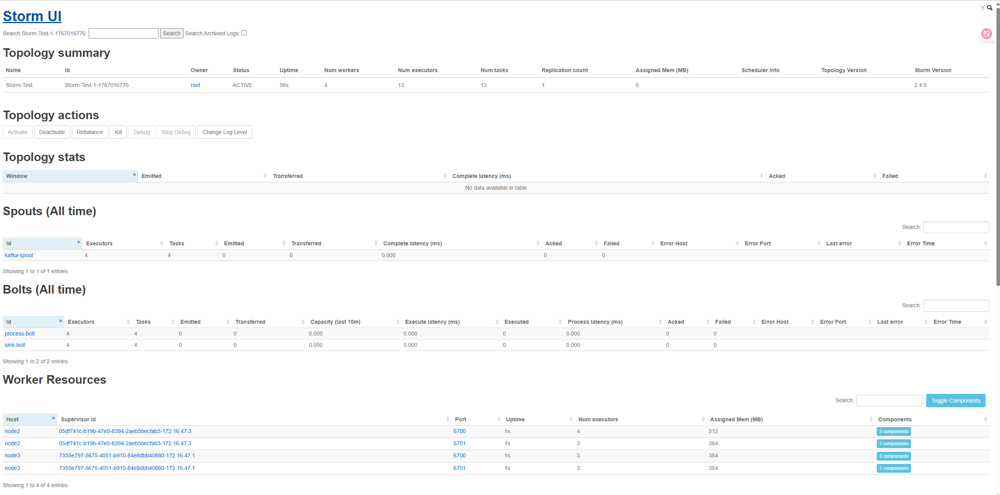

- Spout/Bolt 的 Executed/Acked 数量正常
---

#### 2. 内部故障实验（泊松分布异常注入）

**目标**：在算子/bolt 内部以泊松分布注入异常，考察框架自恢复与重试行为，评估重复率变化。

##### Flink 内部故障实验

```bash
cd /opt/experiment
./cluster-flink-start.sh

# 参数说明：
# - 300000: 总消息数
# - 3000: 发送速率 (msg/s)
# - after: 故障注入位置（处理后）
# - 3000: Lambda参数（平均每45000条触发一次故障，约100次）

./start-flink-fault-test.sh 300000 3000 after 3000

# 等待实验完成
sleep 720  # 约12分钟（故障会延长处理时间）

# 查看结果
./view-status.sh

# 需要固化本轮结果时，手动建快照：
mysql -h node1 -u exp_user -ppassword stream_experiment -e "CALL sp_create_snapshot('flink-qps3000-data300000-内部故障-100');"

./stop-all.sh
```

**故障注入逻辑**（代码片段）：

```java
// FlinkAtLeastOnceJobWithFaultInjection.java
private void injectFaultIfNeeded() {
    processedCount++;
    if (processedCount >= nextFaultAt) {
        // 泊松分布生成下一次故障点
        long interval = (long) (-lambda * Math.log(random.nextDouble()));
        nextFaultAt = processedCount + Math.max(1, interval);
        throw new RuntimeException("[Fault Injection] Simulated failure");
    }
}
```
**截图**：
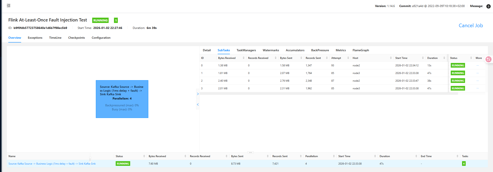
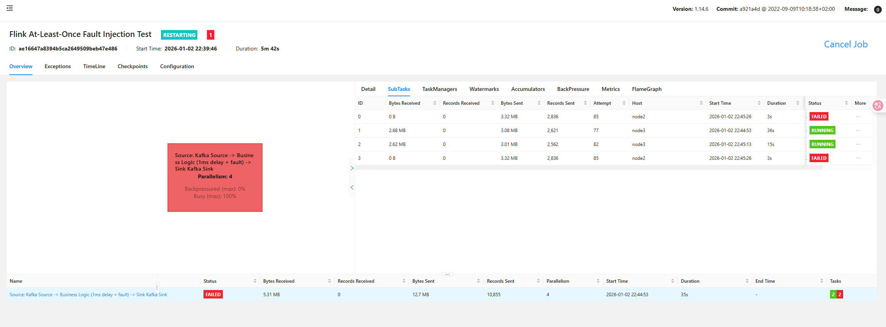
##### Storm 内部故障实验

```bash
cd /opt/experiment
./cluster-storm-start.sh

# 参数说明：
# - 3000000: 总消息数
# - 3000: 发送速率 (msg/s)
# - 1000: Spout Max Pending
# - bolt-after: 故障注入位置（Bolt执行后）
# - 3000: Lambda参数（约40次故障）

./start-storm-fault-test.sh 300000 3000 1000 bolt-after 3000

# 查看结果
./view-status.sh

# 需要固化本轮结果时，手动建快照：
mysql -h node1 -u exp_user -ppassword stream_experiment -e "CALL sp_create_snapshot('storm-qps3000-data300000-内部故障-100');"

./stop-all.sh
```

**实验对比组**（不同故障频率）：

| 故障次数 | Lambda 参数 | Flink 命令 | Storm 命令 |
|---------|------------|-----------|------------|
| 100 次 | 3000 | `./start-flink-fault-test.sh 300000 3000 after 3000` | `./start-storm-fault-test.sh 300000 3000 1000 bolt-after 3000` |
| 150 次 | 2000 | `./start-flink-fault-test.sh 300000 3000 after 2000` | `./start-storm-fault-test.sh 300000 3000 1000 bolt-after 2000` |
| 200 次 | 1500 | `./start-flink-fault-test.sh 300000 3000 after 1500` | `./start-storm-fault-test.sh 300000 3000 1000 bolt-after 1500` |

---

#### 3. 外部故障实验（进程Kill与网络隔离）

**目标**：通过外部脚本注入集群级故障，评估 Flink 与 Storm 的恢复能力与恢复时间。

##### Flink 外部故障实验

**场景 1：Kill TaskManager**

```bash
cd /opt/experiment
./cluster-flink-start.sh
./start-flink.sh 3000 1800000  # 启动正常版本 Job

# 等待 120 秒进入稳定运行期
sleep 120

# 开始故障注入：平均每60秒Kill一次TM，共4次，泊松分布
./inject-fault-flink.sh kill-tm 4 60 poisson
# 脚本会自动：
#   - 随机选择一个 TaskManager 进程并 kill -9
#   - 模拟 YARN 调度延迟（5秒）
#   - 清理残留进程并重启 TaskManager
#   - 等待注册到 JobManager（10秒）
#   - 轮询 Job 状态直至恢复为 RUNNING
#   - 验证数据流是否恢复
#   - 使用泊松分布随机生成下一次注入间隔（平均约60秒）

# 所有数据处理完成后创建快照
mysql -h node1 -u exp_user -ppassword stream_experiment -e \
  "CALL sp_create_snapshot('Flink-外部故障-kill-tm-4次-60s间隔');"

./stop-all.sh
```

**场景 2：Kill JobManager**

```bash
./cluster-flink-start.sh
./start-flink.sh 3000 1800000
sleep 120

# Kill JobManager 并自动重启 + 重新提交 Job
./inject-fault-flink.sh kill-jm 2 60 poisson

mysql -h node1 -u exp_user -ppassword stream_experiment -e \
  "CALL sp_create_snapshot('Flink-外部故障-kill-jm-2次');"

./stop-all.sh
```

**场景 3：网络隔离 TaskManager**

```bash
./cluster-flink-start.sh
./start-flink.sh 3000 1800000
sleep 120

# 通过 iptables 隔离 TM 与 JM 之间的 6121-6130 端口，每次隔离约60秒（遵循泊松分布 重复2次）
./inject-fault-flink.sh network-tm 2 60 poisson

mysql -h node1 -u exp_user -ppassword stream_experiment -e \
  "CALL sp_create_snapshot('Flink-外部故障-network-tm-2次');"

./stop-all.sh
```

##### Storm 外部故障实验

**场景 1：Kill Worker**

```bash
cd /opt/experiment
./cluster-storm-start.sh
./start-storm.sh 3000 1800000
sleep 120

# 随机 Kill Worker，依赖 Nimbus 自动重调度
./inject-fault-storm.sh kill-worker 4 60 poisson
# 脚本会自动：
#   - 从 node2/node3 随机选择一个 Worker 进程 kill -9
#   - 轮询检查 Nimbus 是否重新拉起 Worker（最多60秒）
#   - 新 Worker 启动后等待10秒确保任务分配完成
#   - 验证数据流恢复
#   - 控制注入间隔

mysql -h node1 -u exp_user -ppassword stream_experiment -e \
  "CALL sp_create_snapshot('Storm-外部故障-kill-worker-4次');"

./stop-all.sh
```

**场景 2：Kill Nimbus**

```bash
./cluster-storm-start.sh
./start-storm.sh 3000 1800000
sleep 120

# Kill Nimbus 并自动重启（Topology 状态保存在 Zookeeper）
./inject-fault-storm.sh kill-nimbus 2 60 poisson

mysql -h node1 -u exp_user -ppassword stream_experiment -e \
  "CALL sp_create_snapshot('Storm-外部故障-kill-nimbus-2次');"

./stop-all.sh
```

**场景 3：网络隔离 Worker**

```bash
./cluster-storm-start.sh
./start-storm.sh 3000 1800000
sleep 120

# 通过 iptables 隔离 Worker 与 Nimbus 之间的 6627 端口，每次隔离约60秒（重复2次，固定间隔由脚本内部控制）
./inject-fault-storm.sh network-worker 2 60 fixed

mysql -h node1 -u exp_user -ppassword stream_experiment -e \
  "CALL sp_create_snapshot('Storm-外部故障-network-worker-2次');"

./stop-all.sh
```


---

**实验数据汇总方式**：

所有实验结束后，通过以下 SQL 视图统一分析：

```sql
-- 延迟统计（P50/P95/P99）
SELECT * FROM v_latency_stats;

-- 重复率统计
SELECT * FROM v_duplicate_stats;

-- 综合对比
SELECT * FROM v_comparison;

-- 查看快照历史
SELECT * FROM v_snapshot_history ORDER BY snapshot_time DESC;
```

## 实验结果与分析

#### 1. 消息丢失率

| 实验场景 | Flink 丢失率 | Storm 丢失率 | 结论 |
|---------|-------------|-------------|------|
| 基线实验 | **0%** | **0%** | ✅ 两者均满足 At-Least-Once |
| 内部故障 | **0%** | **0%** | ✅ 内部异常不导致数据丢失 |
| 外部故障 | **0%** | **0%** | ✅ 集群故障也不丢数据 |
| 外部故障 | **0%** | **0%** | ✅ 主节点故障后恢复完整 |
| 网络隔离 | **0%** | **0%** | ✅ 网络恢复后数据完整 |

**结论**：在所有实验场景中，Flink 与 Storm 在正确配置 At-Least-Once 语义后，均未出现消息丢失，满足可靠性要求。通过 MySQL 中 `msg_id` 的唯一性检查，验证了两者都能保证 **"不丢数据"** 的承诺。

---

#### 2. 重复处理率

##### 2.1 基线实验（无故障）

| 框架 | QPS | 总消息数 | 唯一消息数 | 重复消息数 | 重复率 | 最大重复次数 |
|------|-----|----------|-----------|-----------|--------|-------------|
| **Flink** | 3000 | 1,800,000 | 1,800,000 | 0 | **0.00%** | 1 |
| **Storm** | 3000 | 1,800,000 | 1,800,000 | 0 | **0.00%** | 1 |

**分析**：无故障情况下，两者均能实现 **"零重复"**，说明正常运行时 At-Least-Once 等同于 Exactly-Once 的效果。

##### 2.2 内部故障实验（泊松分布异常注入）

实验负载：总消息数：300000；QPS:3000

| 故障参数 (总次数/消息间隔) | Flink 重复率 | Storm 重复率 |
|---------------------------|---------------|---------------|
| 100 / 3000                | **80.10%**    | 0.50%          |
| 150 / 2000                | **80.90%**    | 0.33%        |
| 200 / 1500                | **86.63%**    | 0.17%                  |

**关键发现**：

- **Flink 重复率在内部故障场景中极高**：
  - 例如：100/3000、150/2000、200/1500 三组实验中，Flink 重复率分别约为 80.10%、80.90%、86.63%；
  - 原因：Checkpoint 间隔为 5 秒，故障时回滚到最近一次 Checkpoint，导致 5 秒内的所有数据被整体重放，故障越频繁，回滚次数越多。

- **Storm 重复率始终保持极低**：
  - 在相同三组参数下，Storm 重复率仅为 0.50%、0.33%、0.17%，吞吐量稳定在约 3,500 msg/s；
  - 原因：Tuple Tree + Acker 机制仅重发 **未被 Ack 的单条消息**，其他消息不受影响，故障频率升高主要带来的是个别 Tuple 的重试，而不是大批数据重放。

**图表**：
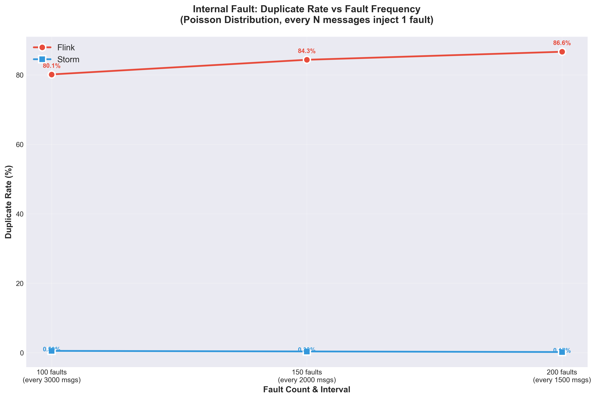
##### 2.3 外部故障实验（进程 Kill）

**Kill Worker 故障**：

| 故障次数 | Flink 重复率 | Storm 重复率 |
|---------|-------------|-------------|
| 1       | 0.36%       | 1.01%       |
| 2       | 0.56%       | 2.98%       |
| 3       | 1.68%       | 3.53%       |
| 4       | 1.12%       | **4.93%**   |

**Kill Master 故障**：

| 故障次数 | Flink 重复率 | Storm 重复率 |
|---------|-------------|-------------|
| 1       | **28.83%**  | 0.00%       |
| 2       | **27.17%**  | 0.00%       |
| 3       | **43.33%**  | 0.00%       |
| 4       | **27.50%**  | 0.00%       |

**网络隔离故障**：

| 故障次数 | Flink 重复率 | Storm 重复率 |
|---------|-------------|-------------|
| 1       | 4.25%       | 0.49%       |
| 2       | 7.13%       | 0.17%       |
| 3       | **9.63%**   | 0.45%       |
| 4       | 5.81%       | 0.59%       |

**关键发现**：

- **Kill Worker 故障：Storm 重复率随故障次数显著上升，Flink 保持低位**：
  - Storm 重复率从 1.01%（1次）增至 4.93%（4次）；
  - Flink 重复率始终保持在 1–2% 以内；
  - 原因：Worker 故障时，Flink 的 Checkpoint 机制能快速从最近快照恢复，而 Storm 需要通过 Acker 重发所有未确认消息，当故障频繁时重发压力累积。

- **Kill Master 故障：Flink 重复率极高，Storm 完全无重复**：
  - Flink 在所有次数下重复率均在 27–43% 之间，需要从 Checkpoint 完整恢复并重新提交 Job；
  - Storm 在所有次数下重复率均为 **0.00%**，因为 Nimbus 故障不影响 Worker 节点的数据处理，Topology 状态由 Zookeeper 保存；
  - 原因：Flink 的 JobManager 是全局状态协调者，故障需要整体恢复；Storm 的 Nimbus 仅负责调度，Worker 自治性强。

- **网络隔离故障：Flink 重复率随隔离次数上升，Storm 始终保持极低水平**：
  - Flink 重复率从 4.25%（1次）升至 9.63%（3次）；
  - Storm 重复率始终 < 1%；
  - 原因：网络隔离导致 Flink TaskManager 心跳超时，触发全局 Checkpoint 回滚；而 Storm 的 Tuple Tree 机制允许单个 Worker 暂时失联后快速重连，仅重发少量未 Ack 消息。

**图表**：
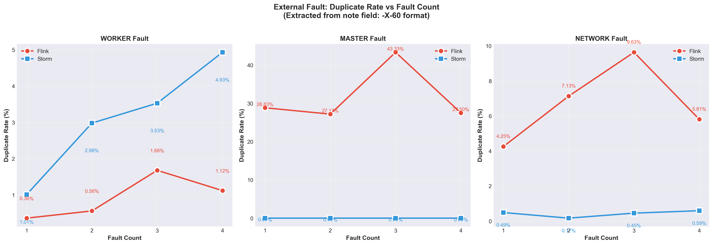
---

#### 3. 延迟与吞吐量性能分析

##### 3.1 基线实验性能对比

| 框架 | 平均延迟 (ms) | P95 延迟 (ms) | P99 延迟 (ms) | 吞吐量 (msg/s) |
|---------|--------------|-------------|-------------|----------------|
| **Flink** | 511.98 | 794 | 4,255 | 3,040.58 |
| **Storm** | 725.11 | 3,105 | 8,111 | 3,044.43 |

**分析**：

- **延迟对比**：
  - Flink 平均延迟低于 Storm（512ms vs 725ms），P99 延迟几乎相当于Storm的一半；
  - Flink 的微批处理与 Checkpoint 机制虽引入额外开销，但在长尾延迟控制上表现更好。

- **吞吐量对比**：
  - 两者在基线场景下吞吐量基本持平（约 3,040 msg/s），均能稳定支撑设计目标。

**图表**：
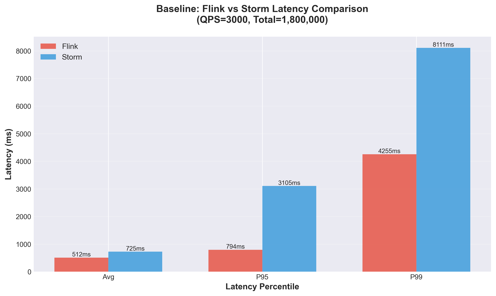
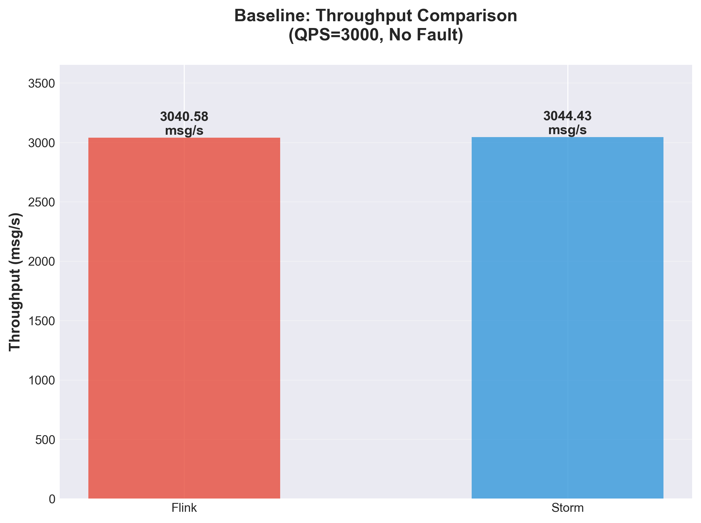

##### 3.2 内部故障场景性能变化

**故障参数：总次数=100，消息间隔=3000（每 3000 条消息注入一次）**

| 框架 | 平均延迟 (ms) | P95 延迟 (ms) | P99 延迟 (ms) | 吞吐量 (msg/s) |
|---------|--------------|-------------|-------------|----------------|
| **Flink** | 180,131 | 409,799 | 424,702 | 573.93 |
| **Storm** | 15,261 | 24,376 | 25,332 | 3,521.42 |

**故障参数：总次数=150，消息间隔=2000（每 2000 条消息注入一次）**

| 框架 | 平均延迟 (ms) | P95 延迟 (ms) | P99 延迟 (ms) | 吞吐量 (msg/s) |
|---------|--------------|-------------|-------------|----------------|
| **Flink** | 195,803 | 392,606 | 411,666 | 590.39 |
| **Storm** | 12,380 | 21,363 | 22,149 | 3,514.12 |

**故障参数：总次数=200，消息间隔=1500（每 1500 条消息注入一次）**

| 框架 | 平均延迟 (ms) | P95 延迟 (ms) | P99 延迟 (ms) | 吞吐量 (msg/s) |
|---------|--------------|-------------|-------------|----------------|
| **Flink** | 333,521 | 603,993 | 641,089 | 402.95 |
| **Storm** | 21,011 | 30,333 | 31,357 | 3,487.12 |

**分析**：

- **Flink 延迟与吞吐量双重崩溃**：
  - 平均延迟从基线的 512ms 暴涨至 **180–334 秒**，P99 延迟从 4.3 秒暴涨至 **7–11 分钟**（411–641 秒）；
  - 吞吐量从 3,040 msg/s 暴跌至 **403–721 msg/s**（下降 76–87%）；
  - Task 重启导致数据积压，恢复后需“追赶”进度，Checkpoint 回滚引发大量重复处理，严重占用处理资源。

- **Storm 延迟与吞吐量保持稳定**：
  - 平均延迟仅从 725ms 微升至 **12–21 秒**，P99 延迟始终保持在 **22–31 秒**范围内；
  - 吞吐量稳定在 **3,487–3,521 msg/s**（仅下降约 2%）；
  - Bolt 异常只影响单个 Tuple，精准重试机制避免了无效重复，整体性能波动极小。

**图表**：
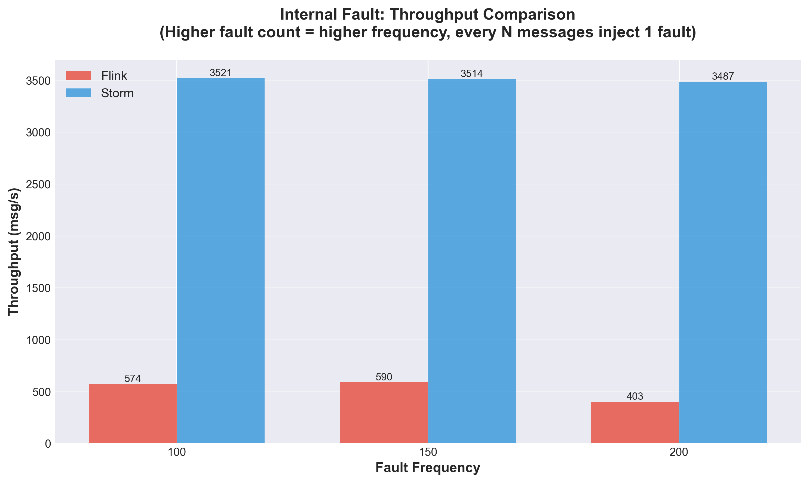
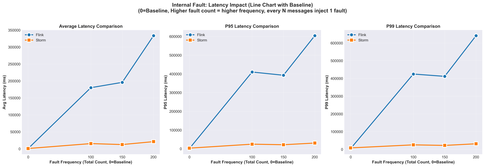
##### 3.3 外部故障场景性能变化

**Kill Worker 故障（1–4 次）**

| 故障次数 | 框架 | 平均延迟 (ms) | P95 延迟 (ms) | P99 延迟 (ms) | 吞吐量 (msg/s) |
|----------|---------|--------------|-------------|-------------|----------------|
| 1 | **Flink** | 1,322 | 7,786 | 17,435 | 3,029.65 |
| 1 | **Storm** | 1,715 | 10,153 | 23,802 | 3,057.31 |
| 2 | **Flink** | 2,279 | 15,133 | 21,982 | 3,015.54 |
| 2 | **Storm** | 7,000 | 54,459 | 75,312 | 3,048.83 |
| 3 | **Flink** | 7,391 | 23,309 | 27,731 | 3,095.53 |
| 3 | **Storm** | 12,500 | 51,575 | 67,560 | 3,086.48 |
| 4 | **Flink** | 5,861 | 25,933 | 35,669 | 3,047.12 |
| 4 | **Storm** | 10,587 | 68,894 | 88,989 | 3,051.28 |

**分析**：

- **延迟对比**：
  - Flink 平均延迟从 1.3 秒缓慢上升至 7.4 秒，P99 延迟从 17 秒上升至 36 秒；
  - Storm 平均延迟从 1.7 秒急剧恶化至 12.5 秒，P99 延迟从 24 秒暴涨至 89 秒；
  - Flink 在 Worker 故障场景下延迟增长更平缓，而 Storm 随故障次数增加延迟加速恶化。

- **吞吐量对比**：两者吞吐量均保持稳定（约 3,030–3,095 msg/s），说明单个 Worker 故障对整体处理能力影响有限。

- **原因**：Worker 故障时，Flink 的 Checkpoint 机制能快速从最近快照恢复，而 Storm 需要通过 Acker 重发所有未确认消息，当故障频繁时重发压力累积，导致延迟非线性增长。

**Kill Master 故障（1–4 次）**

| 故障次数 | 框架 | 平均延迟 (ms) | P95 延迟 (ms) | P99 延迟 (ms) | 吞吐量 (msg/s) |
|----------|---------|--------------|-------------|-------------|----------------|
| 1 | **Flink** | 62,376 | 116,966 | 121,788 | 3,752.35 |
| 1 | **Storm** | 1,367 | 9,718 | 14,691 | 3,078.97 |
| 2 | **Flink** | 65,890 | 120,445 | 128,679 | 3,683.87 |
| 2 | **Storm** | 1,633 | 11,756 | 16,743 | 3,088.89 |
| 3 | **Flink** | 63,257 | 118,163 | 122,903 | 3,753.00 |
| 3 | **Storm** | 989 | 6,250 | 11,237 | 3,060.46 |
| 4 | **Flink** | 65,834 | 120,683 | 128,947 | 3,690.00 |
| 4 | **Storm** | 1,436 | 10,302 | 15,289 | 3,081.37 |

**分析**：

- **延迟对比**：
  - Flink 平均延迟高达 **62–66 秒**，P95 延迟 117–121 秒，P99 延迟 **122–129 秒**；
  - Storm 平均延迟仅 **1–1.6 秒**，P95 延迟 6–12 秒，P99 延迟稳定在 **11–17 秒**；
  - Flink 在 Master 故障下延迟是 Storm 的 **50–60 倍**，显示出两者架构差异的巨大影响。

- **吞吐量对比**：
  - Flink 吞吐量达到 **3,683–3,753 msg/s**（高于基线的 3,040 msg/s），这是因为大量重复处理提高了“处理总量”但并非有效吞吐；
  - Storm 吞吐量稳定在 **3,060–3,089 msg/s**，与基线基本持平。

- **原因**：Flink 的 JobManager 是全局状态协调者，故障需要整体恢复并从 Checkpoint 重放大量数据；Storm 的 Nimbus 仅负责调度，Worker 自治性强，故障对数据处理无影响。

**网络隔离故障（1–4 次）**

| 故障次数 | 框架 | 平均延迟 (ms) | P95 延迟 (ms) | P99 延迟 (ms) | 吞吐量 (msg/s) |
|----------|---------|--------------|-------------|-------------|----------------|
| 1 | **Flink** | 18,510 | 82,069 | 91,752 | 3,019.39 |
| 1 | **Storm** | 1,353 | 8,573 | 11,859 | 3,061.89 |
| 2 | **Flink** | 46,989 | 157,927 | 167,701 | 2,649.13 |
| 2 | **Storm** | 1,451 | 9,315 | 12,851 | 3,059.65 |
| 3 | **Flink** | 96,258 | 265,334 | 275,073 | 2,314.76 |
| 3 | **Storm** | 2,082 | 11,340 | 15,852 | 3,056.01 |
| 4 | **Flink** | 123,892 | 349,661 | 359,270 | 2,084.53 |
| 4 | **Storm** | 2,345 | 12,649 | 15,719 | 3,079.83 |

**分析**：

- **延迟对比**：
  - Flink 平均延迟从 18.5 秒暴涨至 **124 秒**，P95 延迟从 82 秒飙升至 **350 秒**，P99 延迟从 91,752ms 暴涨至 **359,270ms（近 6 分钟）**；
  - Storm 平均延迟始终保持在 **1.4–2.3 秒**，P95 延迟 8.6–12.6 秒，P99 延迟稳定在 **12–16 秒**；
  - 网络隔离是 Flink 最脆弱的故障场景，延迟增长呈指数级，而 Storm 基本不受影响。

- **吞吐量对比**：
  - Flink 吞吐量从 3,019 msg/s **暴跌至 2,085 msg/s（下降 31%）**，随网络隔离次数增加持续恶化；
  - Storm 始终稳定在约 **3,060 msg/s**，波动不超过 1%。

- **原因**：网络隔离导致 Flink TaskManager 心跳超时，触发全局 Checkpoint 回滚，隔离时间越长积压越严重，延迟与吞吐量同步崩溃；Storm 的 Tuple Tree 机制允许单个 Worker 暂时失联后快速重连，仅重发少量未 Ack 消息，对整体性能几乎无影响。

**图表**：
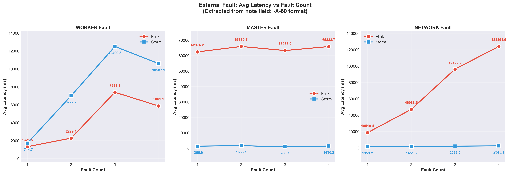
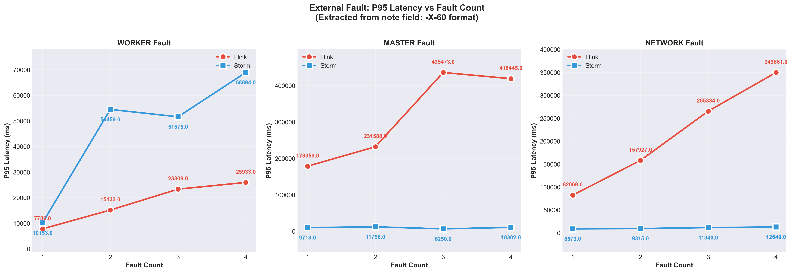
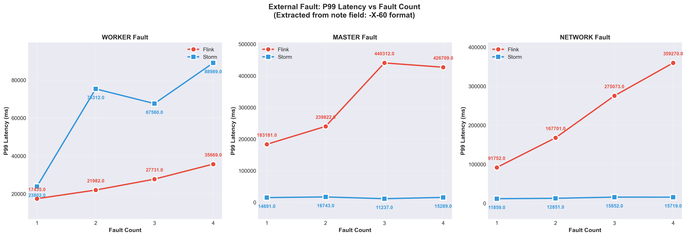
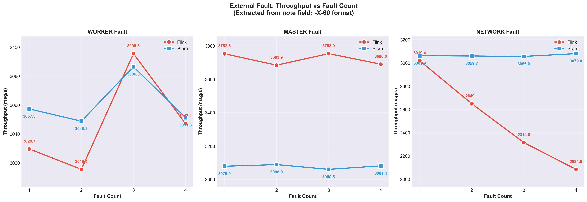

---

### 结论

通过完整的对比实验，本研究验证了 Storm 和 Flink 在 At-Least-Once 语义下的不同实现机制，并在消息可靠性、故障恢复能力、延迟与吞吐等维度得出以下核心结论：

#### 1. 消息可靠性：两者均满足 At-Least-Once，但重复率差异显著

- **零丢失保证**：两种框架在所有实验场景中均未出现消息丢失，充分验证了 At-Least-Once 语义的可靠性。

- **重复率对比**：

  **内部故障场景**：
  - **Flink**：故障时回滚整个 Checkpoint 间隔（5 秒窗口），重复率从 80.10%（100次故障）升至 86.63%（200次故障）；
  - **Storm**：基于 Tuple 级别的精准重试，仅重发未 Ack 的消息，重复率始终保持极低水平（0.17%–0.50%）。

  **外部故障场景**：
  - **Kill Worker**：Flink 重复率保持在 1–2% 以内，Storm 从 1.01% 增至 4.93%；
  - **Kill Master**：Flink 重复率高达 27–43%，Storm 完全无重复（0.00%）；
  - **网络隔离**：Flink 重复率从 4.25% 升至 9.63%，Storm 始终 < 1%。

**架构差异本质**：
- **Flink**：全局协调 + 批量恢复，Master 故障与长时间网络隔离代价极高；
- **Storm**：去中心化处理 + 精准重试，Master 故障几乎无影响，Worker 故障在高频场景下会累积压力。

**适用建议**：
- 如果业务场景能容忍较高重复率（如通过下游幂等去重），Flink 的高吞吐更适合；
- 如果需要严格控制重复处理成本（如金融交易），Storm 的精准重试更优；
- 若集群稳定性高、Master 节点可靠：Flink 在正常运行时吞吐更优；
- 若环境不稳定、频繁出现网络抖动或主节点故障：Storm 的容错韧性更强。

---

#### 2. 延迟与吞吐量性能表现

**基线性能**：
- **延迟对比**：Flink 平均延迟 511.98ms、P99 4,255ms，Storm 平均延迟 725.11ms、P99 8,111ms；Flink 在长尾延迟控制上表现更好；
- **吞吐量对比**：两者均能稳定支撑 **3,040 msg/s**。

**内部故障场景**：
- **Flink 延迟与吞吐量双重崩溃**：P99 延迟从基线的 4.3 秒暴涨至 **10 分钟以上**（641,089ms），吞吐量从 3,040 msg/s 暴跌至 **403 msg/s**；
- **Storm 延迟与吞吐量保持稳定**：P99 延迟始终保持在 **25–31 秒**范围内，吞吐量稳定在 **3,487–3,521 msg/s**。

**外部故障场景**：
- **Kill Worker**：Flink 延迟随故障次数缓慢上升（17–36 秒），Storm 延迟急剧恶化（24–89 秒）；两者吞吐量均保持稳定（约 3,030–3,095 msg/s）；
- **Kill Master**：Flink P99 延迟高达 **122–129 秒**，Storm 稳定在 **11–17 秒**；Flink 吞吐量达到 **3,683–3,753 msg/s**（高于基线，由于大量重复处理），Storm 吞吐量稳定在 **3,060–3,089 msg/s**；
- **网络隔离**：Flink P99 延迟从 91,752ms 暴涨至 **359,270ms（近 6 分钟）**，Storm 始终稳定在 **12–16 秒**；Flink 吞吐量从 3,019 msg/s **暴跌至 2,085 msg/s（下降 31%）**，Storm 始终稳定在约 **3,060 msg/s**。

**适用建议**：
- 对单条消息延迟敏感的场景（如实时推荐、在线告警），优先选择 Storm；
- 更关注整体吞吐与批量处理效率的场景（如数据仓库 ETL），选择 Flink；
- 高吞吐、数据量大但故障较少的场景（如离线批处理转实时），选择 Flink；
- 中等吞吐、故障频繁但需快速恢复的场景（如物联网数据采集），选择 Storm。

---

#### 3. 架构设计哲学的差异

| 维度 | **Flink** | **Storm** |
|------|-----------|----------|
| **容错粒度** | 全局批量（Checkpoint 间隔） | 单条记录（Tuple） |
| **状态管理** | 分布式一致性快照 | Zookeeper + Tuple Tree |
| **故障恢复** | 回滚到上一个 Checkpoint（批量重放） | 精准重发未 Ack 的消息 |
| **适用场景** | 高吞吐、能容忍短暂中断与批量重复 | 低延迟、需精准重试与快速恢复 |

**核心发现**：
- **Flink** 牺牲了故障时的重复率（全局回滚），换取了正常运行时的高吞吐与简化的状态管理；
- **Storm** 牺牲了正常运行时的部分吞吐（Acker 开销），换取了故障时的精准重试与快速恢复。

---

#### 4. 未来优化方向

- **Flink 侧**：
  - 缩短 Checkpoint 间隔（如 1 秒），降低故障时的重复率，但需权衡 Checkpoint 开销；
  - 引入增量 Checkpoint，减少状态同步的网络与存储开销；
  - 在 Standalone 模式下集成自动重启机制（如 Kubernetes）。

- **Storm 侧**：
  - 优化 Acker 性能，降低高并发下的 CPU 与内存开销；
  - 引入状态化 Bolt，支持更复杂的窗口计算与 Join 操作；
  - 提升 Nimbus 高可用性，避免单点故障。

---

**总结**：本实验通过严格的资源对齐与全面的故障注入，量化了 Storm 与 Flink 在 At-Least-Once 语义下的真实表现。两者各有优势，选型时应根据业务对延迟、重复率、恢复时间的优先级进行权衡。

### 分工

| 姓名   | 学号        | 分工                     | 排名 |
| ------ | ----------- | ------------------------ | ---- |
| 郑云贵 | 51285903094 | 环境部署、主要代码撰写、实验设计、撰写报告        | 1    |
| 王安若 | 50255903001 | 基线实验测试、内部故障实验设计与测试、撰写报告、PPT制作    | 2    |
| 汪琳丰 | 51285903125 | 外部故障实验测试(kill taskmanager/worker) 、PPT制作      | 3    |
| 杨一博 | 51285903111 | 外部故障实验测试(kill jobmanager/nimbus)、视频制作         | 4    |
